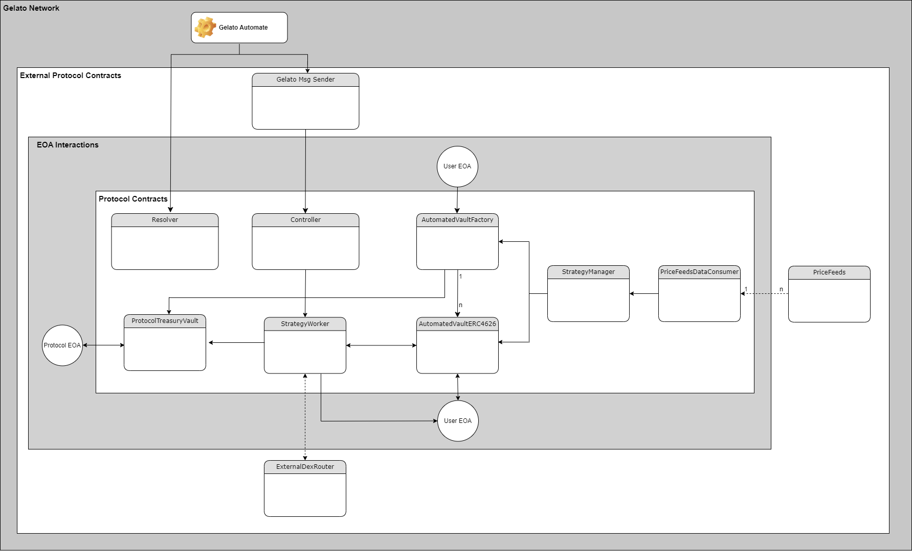

# ERC-4626 Tokenized Automated Strategy Vaults

## Architecture Diagram



### Arbitrum Mainnet Contract Addresses

- **TreasuryVault:** 0x15Fa3FE8331976bd07163BA73A8B4ca102D59CC2
- **Controller:** 0xB53120F3104fF411D3FCd8C257A0B58600da73C3
- **StrategyWorker:** 0x43Cc4744343fC5d44F27f4Ff2d97D18b261aEeC8
- **AutomatedVaultsFactory:** 0xF45309A5269a28e4F49Ab3aDd7aAFC70b1362E85
- **Resolver:** 0xe7fb1342cFAa2DC7cb900a722E7473114c1142D3
- **StrategyManager:** 0xEBF39FB51c23918F2FcbbD0600Bb6dE1546a37C3
- **PriceFeedsDataConsumer:** 0xAf91B43247E70b96387392d26c452B587e9870Fa
- **Gelato Msg Sender:** 0xf454b2cb8c149a64acde77d8b74b10019a21e2bf

# Project Setup Guide

## Installation Requirements

To work with and test contracts, you need to have Brownie installed. You can install Brownie via pipx, which is the recommended method:

[Install Brownie](https://eth-brownie.readthedocs.io/en/stable/install.html)

Please note that some packages required by Brownie do not currently have pre-built binaries compatible with Python versions above 3.9.

For Windows users using Python versions above 3.9, you have two options:

1. Install Windows Subsystem for Linux (WSL) and run this project within WSL.
2. Follow this guide for alternative installation instructions: [Cannot Install Eth-Brownie with Pipx](https://ethereum.stackexchange.com/questions/148617/cannot-install-eth-brownie-with-pipx) (Note: We haven't tested this method yet)

Once you have Brownie installed, you can compile and interact with this project's contracts using the Brownie shell:

```
brownie console --network [NETWORK_ID]
```

To view available NETWORK_ID values:

```
brownie networks list
```

**Note:** For interacting with any **writting function**, you will need to create a .env file in this project's root folder containing at least 1 private key and then specify the key you've defined for this PK in "brownie-config.yaml" file also located in this project's root.

**Example:**

**.env file**

```
export PRIVATE_KEY_1=<YOUR PRIVATE KEY>
```

**brownie-config.yaml file**

```
wallets:
  from_key_1: ${PRIVATE_KEY_1}
```

Finally you can access a python object containing all the funcionalities associated with a brownie account (inside a brownie shell or a python script) as exemplified above:

```
from brownie import accounts
accounts.add(config["wallets"]["from_key_1"])

```

## Running Integration Tests

All integration tests in this repository should be executed on a locally forked testnet.

1. Install ganache-cli.
2. Add Arbitrum Mainnet Fork Example:

- Add the following entry to your network-config.yaml file, which is located inside Brownie installation folder:

```
- cmd: ganache-cli
  cmd_settings:
    accounts: 10
    evm_version: istanbul
    fork: arbitrum-main
    gas_limit: 12000000
    mnemonic: brownie
    port: 8545
  host: http://127.0.0.1
  id: arbitrum-main-fork
  name: Ganache-CLI (Arbitrum-Mainnet Fork)
  timeout: 120
```

3. Add all the required testing addresses to the "brownie-config.yaml" file located in this project's root (already done for Arbitrum)
4. Add 3 different private keys to your .env file that match the testing requirements:

**.env file**

```
export PRIVATE_KEY_1=<YOUR PRIVATE KEY>
export PRIVATE_KEY_2=<YOUR PRIVATE KEY>
export PRIVATE_KEY_2=<YOUR PRIVATE KEY>
```

**Testing Requirements:**

PRIVATE_KEY_1 - This wallet must have enough ether and token balances for creating 1 strategy vault and executing 1 deposit.

PRIVATE_KEY_2 - This wallet must have enough ether and token balances for executing 1 deposit.

PRIVATE_KEY_3 - This wallet must be empty.

Now, you should be able to run all tests on your locally forked Arbitrum Mainnet by executing the following command:

```
brownie test -s --network arbitrum-main-fork
```

**Tip:** Add **--interactive** to the provided command if you want to keep a Brownie shell open after some tests fail.
